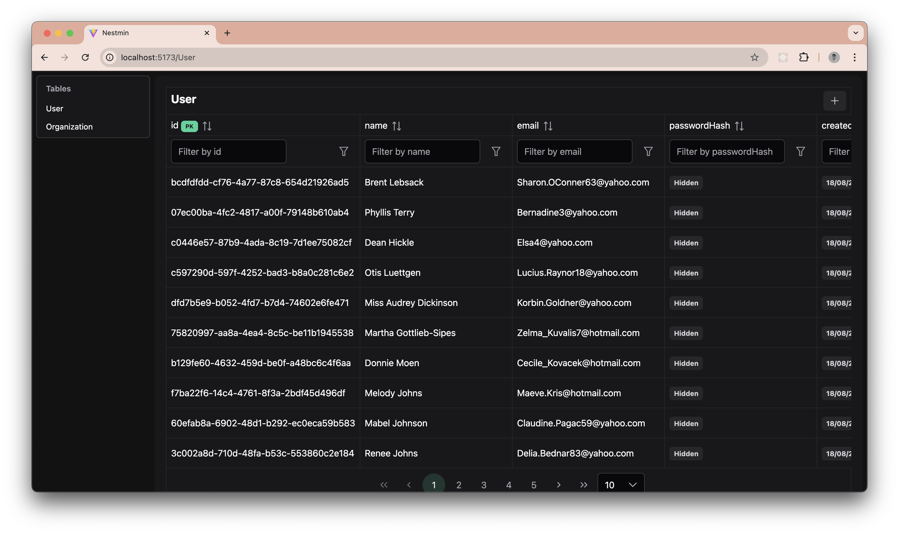

# @will2hew/nestmin

Nestmin is a UI built on top of TypeORM and NestJS to help you view and manage your database. It creates a generic interface for all of your tables to create, delete, edit and view data.



## Quick Start

This guide assumes you already have configured NestJS and TypeORM.

1. Run `npm install @will2hew/nestmin`
2. Import the module into your `AppModule` before TypeORM. You must provide a prefix for Nestmin to run under, and a guard that should check if a user is authenticated before giving access.

```ts
import { Module } from "@nestjs/common";
import { TypeOrmModule } from "@nestjs/typeorm";
import { NestminModule } from "@will2hew/nestmin";
import { AuthGuard } from "./auth.guard";

@Module({
  imports: [
    TypeOrmModule.forRoot({
      // Your database config
    }),
    NestminModule.register({
      prefix: "admin",
      guard: AuthGuard,
    }),
  ],
})
export class AppModule {}
```
